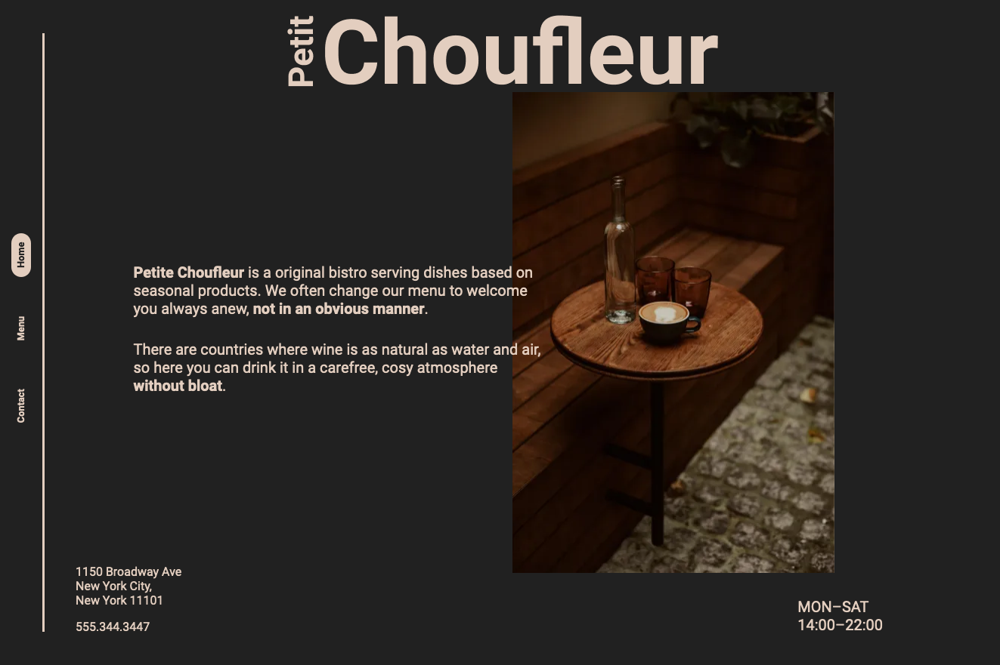

# Restaurant Page

> A simple restaurant page to practice utilizing JavaScript for dynamic rendering. Aside from a hard coded `
` element with an id of `#content`, DOM elements are generated through JavaScript using ES6 Modules. Use of npm and Webpack is also explored in this project for my first time.

## Built With

- JavaScript
- Npm
- Webpack

## Live Demo

[Live Demo Link](https://antonyotero.github.io/restaurant-page/#home)

## Author

👤 **Antony Otero**

- GitHub: [@AntonyOtero](https://github.com/AntonyOtero)
- Twitter: [@AntonyOtero](https://twitter.com/AntonyOtero)
- LinkedIn: [AntonyOtero](https://linkedin.com/in/antonyotero)

## 🤝 Contributing

Contributions, issues, and feature requests are welcome!

Feel free to check the [issues page](https://github.com/AntonyOtero/restaurant-page/issues).

## Show your support

Give a ⭐️ if you like this project!

## Acknowledgments

- [Microverse](https://www.microverse.org/)
- [The Odin Project](https://www.theodinproject.com/)
- [SuperHi](https://www.superhi.com/)
- [Khroma](http://khroma.co/) by [@GeorgeHastings](https://github.com/georgehastings)

## 📝 License

This project is [MIT](./MIT.md) licensed.
